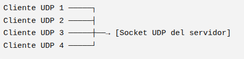
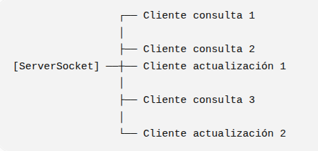
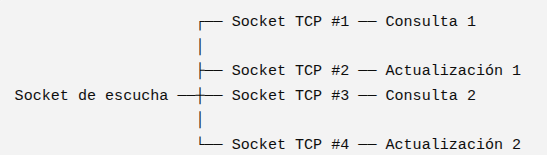

# Diseño arquitectura

## Resumen
Se plantea una arquitectura **híbrida** cliente-servidor, en la cual varios clientes de diferentes tipos se comunican simultáneamente con un único servidor.

La arquitectura utilizará TCP y UDP, seleccionando el protocolo de acuerdo con las características y necesidades de cada tipo de cliente:

* Los clientes de consulta utilizarán TCP, debido a que necesitan enviar una solicitud y recibir una respuesta de manera confiable.
* Los clientes de actualización utilizarán TCP, debido a que envían información que debe ser procesada correctamente por el servidor y requieren una confirmación.
* Los clientes de notificación utilizarán UDP, debido a que únicamente necesitan enviar mensajes breves y no requieren una respuesta inmediata.

Para minimizar la cantidad de sockets y servicios que debe administrar el servidor, los clientes de consulta y actualización compartirán el mismo servicio TCP, mientras que los clientes de notificación utilizarán un servicio UDP independiente.

---
## Parte 1
**Diagrama de la arquitectura**

El siguiente diagrama representa de manera general la arquitectura propuesta para la comunicación entre los diferentes tipos de clientes y el servidor.

En él se muestran los principales elementos que intervienen en la comunicación:

**Procesos cliente**: representan las aplicaciones que generan las solicitudes, actualizaciones o notificaciones.
**Proceso servidor**: representa la aplicación encargada de recibir y procesar las comunicaciones provenientes de los diferentes clientes.
**Sockets**: muestran los puntos de comunicación utilizados por el servidor para recibir y enviar información.
**Puertos**: identifican los servicios mediante los cuales el servidor recibe las comunicaciones.
**Protocolos**: indican si la comunicación utiliza TCP o UDP.
**Dirección del flujo de información**: las flechas indican si los datos se desplazan del cliente hacia el servidor, del servidor hacia el cliente o en ambas direcciones.

La arquitectura se divide principalmente en dos canales de comunicación: TCP para los clientes de consulta y actualización, y UDP para los clientes de notificación.


---

## Parte 2
**1. ¿Que protocolo utilizarán para cada tipo de cliente?**
|Cliente|Protocolo|Justificacion|
|---|---|---|
|Consulta|TCP|TCP garantiza que la solicitud y la respuesta lleguen de forma confiable y en orden. Esto es importante porque el cliente necesita recibir una respuesta correspondiente a la solicitud que realizó.|
|Actualizacion|TCP|La información enviada debe llegar correctamente al servidor para poder ser procesada. TCP proporciona una comunicación confiable y permite que el servidor envíe una confirmación al cliente una vez procesada la información.|
|Notifiacion|UDP| Los mensajes de notificación son breves y no requieren una respuesta inmediata. UDP no necesita establecer una conexión antes de enviar los datos y tiene una menor sobrecarga, por lo que resulta adecuado para este tipo de comunicación.|

**2. ¿Cuantos sockets tendra el servidor?**

La arquitectura propuesta utiliza la siguiente cantidad de sockets:
|Tipo|Cantidad|
|-------|------|
| Sockets UDP|1|
|Sockets TCP de conexión|1|
|Sockets TCP de comunicación|1 por cada cliente TCP conectado|

<br>

**Consulta**

Los clientes de consulta necesitan establecer una comunicación bidireccional, ya que primero realizan una solicitud y posteriormente deben recibir la información solicitada.

El flujo de información es:

*Cliente → Solicitud → Servidor*

*Cliente ← Respuesta ← Servidor*

Por lo tanto, se utiliza TCP, ya que la pérdida de la solicitud o de la respuesta impediría completar correctamente la operación.


**Actualización**

Los clientes de actualización envían información al servidor para que sea procesada y posteriormente requieren recibir una confirmación.

El flujo de información es:

*Cliente → Información → Servidor*

*Cliente ← Confirmación ← Servidor*

Se utiliza TCP porque es necesario garantizar que la información enviada llegue correctamente al servidor. Una vez procesada, el servidor puede enviar una confirmación al cliente.

**Notificación**

Los clientes de notificación únicamente necesitan enviar un mensaje al servidor y no requieren recibir una respuesta inmediata.

El flujo de información es:

*Cliente → Notificación → Servidor*

Por esta razón se utiliza UDP, que permite enviar el mensaje sin establecer previamente una conexión TCP y tiene una menor sobrecarga.

<br>
ejemplo:
*Si tenemos 5 clientes de consulta, 3 de actualizacion y 4 de notificacion, el servidor tendra 1 socket UDP, 1 socket TCP de escucha y 8 sockets TCP de comunicacion, si los clientes de consulta/actualizacion estan simultaneamente conectados*


**3. ¿Cuantos puertos utilizara?**

|Cliente|Protocolo|Puerto|
|---|---|---|
|consulta|TCP|5000|
|actualización|TCP|5000|
|notificación|UDP|5001|

justificacion:

Los servicios de consulta y actualización compartirán el puerto TCP 5000, debido a que ambos utilizan TCP y requieren una comunicación bidireccional entre el cliente y el servidor.

No es necesario crear un puerto TCP diferente para cada tipo de cliente.
El servidor puede distinguir el tipo de solicitud mediante la información contenida en el mensaje enviado por el cliente. De esta manera, un mismo servicio TCP puede atender tanto solicitudes de consulta como solicitudes de actualización.

Para las notificaciones se utilizará el puerto UDP 5001, ya que corresponden a un protocolo diferente y no requieren una comunicación orientada a conexión.
|Arquitectura ideal | Arquitectura secundaria|
|---|---|
|img/arch_ideal.png|img/arch_not_ideal.png|

---

## Parte 3
Socket UDP:
El servidor tendrá un único socket UDP asociado al puerto destinado al servicio de notificaciones.

Este socket puede recibir mensajes provenientes de múltiples clientes UDP, por lo que no es necesario crear un socket independiente para cada cliente.

El funcionamiento puede representarse de la siguiente manera:


El servidor puede distinguir el origen de cada mensaje mediante la información del remitente proporcionada por UDP, como la dirección IP y el puerto de origen.


Socket TCP conexion:
El servidor tendrá un único socket TCP de escucha.

Su función principal es esperar y aceptar las conexiones de los clientes TCP. Este socket no se utiliza directamente para intercambiar los datos de todos los clientes, sino que permanece esperando nuevas conexiones.

El flujo general es:



El socket de escucha permanece disponible para aceptar nuevas conexiones de clientes de consulta y actualización.

Socket TCP comunicación:
Cada vez que el servidor acepta una nueva conexión TCP, se obtiene un socket de comunicación asociado específicamente con ese cliente.

Por lo tanto, si existen N clientes TCP conectados simultáneamente:

Número de sockets TCP de comunicación = N

Estos sockets pueden corresponder tanto a clientes de consulta como a clientes de actualización.


---

## Implementacion

Máquina A (Servidor): Corre server.py escuchando en los puertos 5000/TCP (Consulta/Actualización) y 5001/UDP (Notificaciones).

Máquina B (Cliente Lote 1): Ejecuta 15 clientes en paralelo (5 Consulta, 3 Actualización, 7 Notificación).

Máquina C (Cliente Lote 2): Ejecuta 15 clientes en paralelo (5 Consulta, 2 Actualización, 8 Notificación).

1. Servidor
 
    1. Preparación de red

        a. Obtener la IP local de la máquina del servidor.
         
        ```bash
        ip a
        ```
         
        b. Identificar la interfaz de red. Esta ip se tiene que poner en los programas del cliente.
         
        ```bash
        ip route
        ``` 
        
    2. ejecucion
        
        a. Se ejecuta el comando siguiente para mentener activo el servidor
         
        ```bash
        python3 server.py
        ```
         
2. Cliente Maquina A
 
    1. Preparación de red
        
        a. Se tiene que tener los siguientes programas
         
        ```bash
        client_update.py
        client_query.py
        client_notify.py
        run_client_1.sh
        ```
         
        b. Se ejecuta el archivo .sh para simular las instancias
         
        ```bash
        chmod +x run_machine_b.sh
        ./run_machine_b.sh
        ```  

3. Cliente Maquina B
 
    1. Preparación de red
        
        a. Se tiene que tener los siguientes programas
         
        ```bash
        client_update.py
        client_query.py
        client_notify.py
        run_client_2.sh
        ```
         
        b. Se ejecuta el archivo .sh para simular las instancias
         
        ```bash
        chmod +x run_machine_b.sh
        ./run_machine_b.sh
        ```